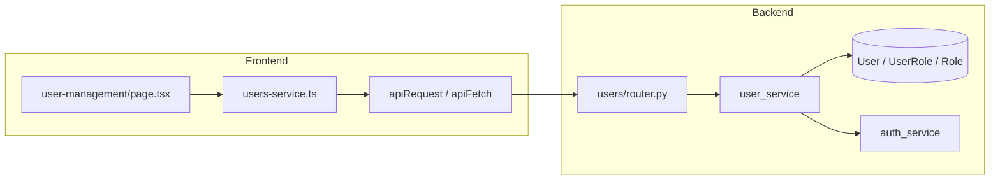

# Module quản lý người dùng (Users)

Tài liệu onboarding cho lập trình viên tiếp tục phát triển. Chi tiết contract HTTP xem [api-contracts.md](./api-contracts.md) (mục **Users**); mã lỗi xem [api-error-codes.md](./api-error-codes.md).

---

## 1. Phạm vi

### 1.1 Thuộc module Users (backend)

- Quản lý tài khoản người dùng theo tổ chức (`org_id`): tạo, liệt kê, xem chi tiết, cập nhật.
- Gán vai trò (thao tác trên bảng `user_roles`; API trả về `roles` và `role` tương thích).
- Vô hiệu hóa tài khoản (soft delete).
- Đặt lại mật khẩu (admin) và đổi mật khẩu bản thân (`/users/me/change-password`).
- Thu hồi toàn bộ phiên đăng nhập của một user (admin).
- Liệt kê role phục vụ dropdown trên màn quản lý user: `GET /users/rbac/roles` (cần `users.read`, không thay thế module RBAC đầy đủ).

### 1.2 Không thuộc package Python `users` (chỉ liên quan UI hoặc domain khác)

- **Auth**: đăng nhập, refresh, logout — [`backend/modules/auth/`](../backend/modules/auth/).
- **RBAC đầy đủ** (tạo/sửa role, gán permission cho role): [`backend/modules/rbac/`](../backend/modules/rbac/) và endpoint `/rbac/...`.
- **Audit log** (đọc log): API audit; FE hiển thị trong tab cùng trang `/user-management`.

### 1.3 Frontend

- Route: **`/user-management`** — [`frontend/src/app/user-management/page.tsx`](../frontend/src/app/user-management/page.tsx).
- Trang gồm các tab chính: **Người dùng**, **RBAC**, **Audit**. URL chỉ đồng bộ tab RBAC: **`/user-management?tab=rbac`** (nếu thiếu quyền đọc RBAC, FE redirect về `/user-management`). Tab **Audit** chỉ là state trong trang, không ghi query string.

---

## 2. Luồng tổng quan

- Hầu hết endpoint `/users/...` yêu cầu header **Bearer** hợp lệ và permission tương ứng.
- Đa số thao tác theo org: query **`org_id`** (hoặc body `org_id` khi `POST /users`). Server gọi `ensure_org_scope(principal.org_id, org_id)` để chặn vượt tenant.

---

## 3. Backend

### 3.1 Cấu trúc thư mục

| File | Vai trò |
|------|---------|
| [`backend/modules/users/router.py`](../backend/modules/users/router.py) | Định nghĩa HTTP API, `Depends`, audit sau thao tác, `db.commit()`. |
| [`backend/modules/users/service.py`](../backend/modules/users/service.py) | Nghiệp vụ, truy vấn DB, mật khẩu bcrypt, gọi `auth_service` khi cần. |
| [`backend/modules/users/schemas.py`](../backend/modules/users/schemas.py) | Pydantic: `UserCreate`, `UserUpdate`, `UserResponse`, v.v. |
| [`backend/modules/users/__init__.py`](../backend/modules/users/__init__.py) | Export router (nếu có). |
| [`backend/database/models.py`](../backend/database/models.py) | Model `User`, `UserRole`, `Role`, … |

Router được gom vào app qua [`backend/modules/__init__.py`](../backend/modules/__init__.py).

### 3.2 Bảng endpoint và permission

Thứ tự route trong FastAPI: **`GET /users/rbac/roles`** khai báo **trước** `GET /users/{user_id}` để tránh `user_id` nuốt chữ `rbac`.

| Method | Path | Permission | Query / body đặc biệt |
|--------|------|------------|----------------------|
| `POST` | `/users` | `users.create` | Body: `UserCreate` (có `org_id`). |
| `GET` | `/users` | `users.read` | Query tùy chọn: `org_id`, `role_id`, `is_active`, `department`. Nếu thiếu `org_id` thì dùng `principal.org_id`. |
| `GET` | `/users/rbac/roles` | `users.read` | Query **bắt buộc**: `org_id`. |
| `GET` | `/users/{user_id}` | `users.read` | Query **bắt buộc**: `org_id`. |
| `PATCH` | `/users/{user_id}` | `users.update` | Query **bắt buộc**: `org_id`. Body: `UserUpdate`. |
| `PATCH` | `/users/{user_id}/role` | `users.assign_role` | Query **bắt buộc**: `org_id`. Body: `{ "role_id": "uuid" }`. |
| `POST` | `/users/{user_id}/sessions/revoke-all` | `users.manage_sessions` | Query **bắt buộc**: `org_id`. |
| `DELETE` | `/users/{user_id}` | `users.delete` | Query **bắt buộc**: `org_id`. |
| `POST` | `/users/{user_id}/reset-password` | `users.reset_password` | Query **bắt buộc**: `org_id`. Body: `ResetPasswordRequest` (`new_password` optional). |
| `POST` | `/users/me/change-password` | Bearer (principal) | **Không** dùng `require_permissions`; dùng `get_current_principal`. Cookie refresh (alias theo `auth_service`) để giữ phiên hiện tại khi đổi mật khẩu. Body: `current_password`, `new_password`. |

### 3.3 Model và dữ liệu

- **`users`**: thông tin hồ sơ, `password_hash`, `is_active`, `disabled_at`, `must_change_password`, `token_version`, `last_login`, …
- Cột **`User.role_id`** (FK tới `roles`) vẫn tồn tại trên model; logic gán role trong `UserService.update_user` đồng bộ qua bảng **`user_roles`** (xóa assignment cũ, thêm bản ghi mới khi đổi `role_id`).
- **`UserResponse`**: build từ danh sách role trong `user_roles` join `roles`; `role` = phần tử đầu (theo tên role sort asc), `role_id` = id role đầu; `roles` = toàn bộ `{id, name}`.

### 3.4 Hành vi nghiệp vụ quan trọng (service)

- **Tạo user**: kiểm tra trùng email/username (không phân biệt hoa thường với email theo code hiện tại dùng `ilike`), `validate_password_strength`, role phải thuộc org hoặc system (hàm `_validate_role`).
- **Cập nhật user**: ít nhất một field trong `UserUpdate`; đổi `role_id` → xóa `UserRole` của user, thêm mới, `token_version += 1`, invalidate cache phiên bản token.
- **Đặt `is_active: false`**: tương tự bump `token_version` và invalidate cache (theo nhánh `is_active` trong `update_user`).
- **Soft delete** (`soft_delete_user`): user phải đang active; set `is_active=false`, `disabled_at`, `updated_at`; gọi `admin_revoke_all_sessions_for_user`. *(Implementation hiện tại không tăng `token_version` trong hàm này — nếu cần vô hiệu JWT access ngay lập tức, cân nhắc bổ sung và cập nhật api-contracts.)*
- **Reset mật khẩu admin**: nếu có `new_password` thì dùng luôn và `must_change_password=false`; nếu không → random 16 ký tự, `must_change_password=true`. Luôn revoke toàn bộ session của user đó.
- **Đổi mật khẩu của chính mình**: verify mật khẩu cũ, policy mật khẩu mới, bump `token_version`, revoke các session khác (giữ session hiện tại nếu refresh token cookie khớp logic trong `auth_service`).

### 3.5 Audit

Sau các thao tác nhạy cảm, router gọi `audit_service.record(...)` rồi `db.commit()`. Ví dụ action:

- `users.create`, `users.update`, `users.role.assign`
- `auth.session.revoke.admin`
- `user.soft_delete`, `user.reset_password`, `user.change_password`

FE map một số chuỗi action sang nhãn tiếng Việt trong [`frontend/src/app/user-management/page.tsx`](../frontend/src/app/user-management/page.tsx) (`formatAuditAction`).

---

## 4. Frontend

### 4.1 Trang và điều hướng

- [`frontend/src/app/user-management/page.tsx`](../frontend/src/app/user-management/page.tsx): bảng user, drawer tạo/sửa/chi tiết, tab RBAC & Audit, gọi service layer.
- Vào màn hình cần permission **`users.read`** (xem [`frontend/src/lib/auth-routes.ts`](../frontend/src/lib/auth-routes.ts)).
- [`frontend/src/components/layout/app-shell.tsx`](../frontend/src/components/layout/app-shell.tsx): link profile có thể trỏ `/user-management` nếu user có `users.read`.

### 4.2 Service HTTP

[`frontend/src/services/users-service.ts`](../frontend/src/services/users-service.ts):

- `getUsers`, `getUserById`, `createUser`, `updateUser`, `assignRoleToUser`, `getRoles` (→ `/users/rbac/roles`), `resetPassword`, `softDeleteUser`, `revokeAllUserSessions`, `changeMyPassword`.
- `getUsers` **luôn** gửi `org_id` trên query string (khớp yêu cầu backend cho các filter).

### 4.3 Quyền UI (feature flags)

[`frontend/src/hooks/use-permission-flags.ts`](../frontend/src/hooks/use-permission-flags.ts) ánh xạ permission → `canCreateUser`, `canUpdateUser`, `canAssignRole`, `canResetPassword`, `canManageSessions`, `canDeleteUser`, …

Component [`frontend/src/components/shared/require-permissions.tsx`](../frontend/src/components/shared/require-permissions.tsx) (và hook `useAuth`) dùng để ẩn/hiện nút theo permission.

### 4.4 Types và lỗi

- Types user: [`frontend/src/types/users.ts`](../frontend/src/types/users.ts) (`UserResponse`, `UserCreatePayload`, `UserUpdatePayload`, …).
- Map lỗi API: [`frontend/src/api/users-error-map.ts`](../frontend/src/api/users-error-map.ts).

### 4.5 Hook `useUsers` (lưu ý)

[`frontend/src/api/hooks/use-users.ts`](../frontend/src/api/hooks/use-users.ts) gọi `GET /users` **không** truyền `org_id` và dùng type `User` rút gọn. **Không** dùng làm nguồn sự thật cho màn quản trị đầy đủ; ưu tiên `users-service.ts` + `UserResponse` để khớp backend.

---

## 5. Kiểm thử và tài liệu liên quan

- Chiến lược test: [testing-strategy.md](./testing-strategy.md) (backend integration users/rbac; gợi ý FE cho `/user-management?tab=rbac`).
- User flow liên quan đổi mật khẩu / revoke session: [user-flows.md](./user-flows.md).

Lệnh tham khảo (từ repo root, xem [AGENTS.md](../AGENTS.md)):

- Backend: `pytest` trong thư mục `backend/`.
- Frontend: `npm run lint`, `npm run test` trong `frontend/`.

---

## 6. Checklist khi chỉnh sửa module

1. Đổi contract HTTP → cập nhật [api-contracts.md](./api-contracts.md), [api-error-codes.md](./api-error-codes.md) (và [security-rules.md](./security-rules.md) nếu ảnh hưởng phân quyền).
2. Đổi schema DB → migration Alembic + [database-schema.md](./database-schema.md).
3. Đổi FE → `users-service.ts`, `frontend/src/types/users.ts`, có thể `users-error-map.ts` và các chỗ `formatAuditAction` nếu thêm action audit mới.
4. Tách UI khỏi `page.tsx` lớn → tạo component dưới `frontend/src/app/user-management/_components/` (theo quy ước repo).

---

## 7. Tài liệu ngoài repo (tham khảo)

- Quy ước module backend/frontend: [AGENTS.md](../AGENTS.md), [backend/AGENTS.md](../backend/AGENTS.md), [frontend/AGENTS.md](../frontend/AGENTS.md).
